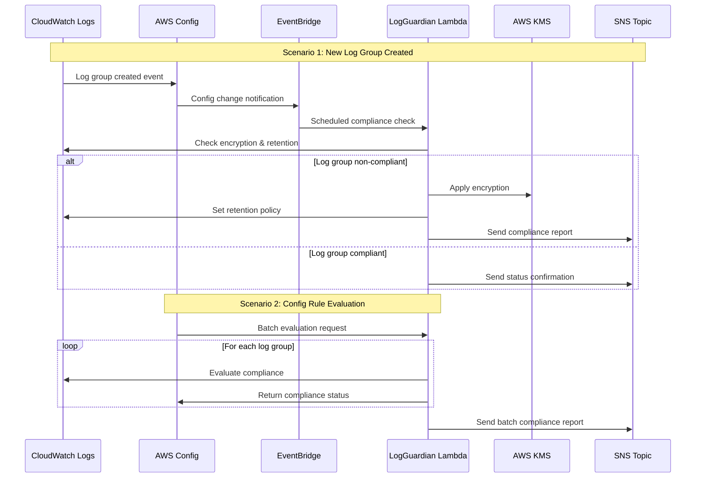
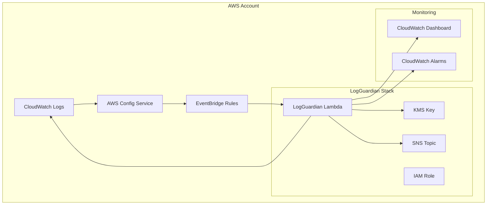

# LogGuardian - AWS CloudWatch Log Compliance Automation

**Enterprise-grade automation for CloudWatch log group encryption, retention, and compliance monitoring**

**License:** [MIT](https://opensource.org/licenses/MIT) | **Language:** [Go 1.2+](https://golang.org/) | **Platform:** [AWS SAM](https://aws.amazon.com/serverless/sam/)

## 🚀 Quick Deploy

Deploy LogGuardian in **under 5 minutes** from AWS Serverless Application Repository:

**Option 1: Deploy with AWS Console**
1. Click "Deploy" button above
2. Configure parameters as needed
3. Deploy to your AWS account

**Option 2: Deploy with AWS CLI**
```bash
# Deploy with default settings (creates all infrastructure)
aws serverlessrepo create-cloud-formation-template \
  --application-id arn:aws:serverlessrepo:ca-central-1:410129828371:applications/LogGuardian \
  --semantic-version 1.0.1

# Deploy to existing infrastructure (enterprise mode)
aws cloudformation deploy \
  --template-file template.yaml \
  --stack-name logguardian \
  --parameter-overrides CreateKMSKey=false CreateConfigService=false \
  --capabilities CAPABILITY_NAMED_IAM
```

## 📋 What LogGuardian Does

LogGuardian automatically ensures your AWS CloudWatch log groups meet enterprise compliance standards:

- ✅ **Encryption**: Enforces KMS encryption on all log groups
- ✅ **Retention**: Sets appropriate log retention policies
- ✅ **Compliance**: Continuous monitoring via AWS Config rules
- ✅ **Automation**: Zero-touch remediation and reporting

## 🔄 How It Works



## 🏗️ Architecture Overview

LogGuardian integrates seamlessly with your AWS infrastructure:



## 🎯 Deployment Scenarios

### 1. **New AWS Account** (Default)
Perfect for new AWS accounts or dedicated compliance environments:
```yaml
CreateKMSKey: true
CreateConfigService: true
CreateConfigRules: true
CreateEventBridgeRules: true
```

### 2. **Existing Infrastructure** (Enterprise)
Use your existing AWS Config service, KMS keys, and rules:
```yaml
CreateKMSKey: false
ExistingKMSKeyArn: "arn:aws:kms:region:account:key/key-id"
CreateConfigService: false
ExistingConfigBucket: "your-config-bucket"
CreateConfigRules: false
```

### 3. **Manual Invocation Only**
Deploy without automated scheduling for on-demand compliance checks:
```yaml
CreateEventBridgeRules: false
```

## ⚙️ Configuration Parameters

| Parameter | Description | Default | Enterprise Use |
|-----------|-------------|---------|----------------|
| `CreateKMSKey` | Create new KMS key for encryption | `true` | `false` (use existing) |
| `ExistingKMSKeyArn` | ARN of existing KMS key | - | Required if CreateKMSKey=false |
| `CreateConfigService` | Set up AWS Config service | `true` | `false` (use existing) |
| `ExistingConfigBucket` | Existing Config S3 bucket | - | Required if CreateConfigService=false |
| `CreateConfigRules` | Create Config rules | `true` | `false` (use existing) |
| `CreateEventBridgeRules` | Schedule automated checks | `true` | `false` (manual only) |
| `DefaultRetentionDays` | Default log retention period | `30` | Customize per policy |
| `LambdaMemorySize` | Lambda memory allocation | `256` | `512` for large accounts |

## 🔐 Security & Permissions

LogGuardian follows AWS security best practices:

- **Least Privilege**: IAM role with minimal required permissions
- **Encryption**: All data encrypted in transit and at rest
- **VPC Compatible**: Can be deployed in private subnets
- **CloudTrail**: All actions logged for audit trails

### Required IAM Permissions
```json
{
  "Version": "2012-10-17",
  "Statement": [
    {
      "Effect": "Allow",
      "Action": [
        "logs:DescribeLogGroups",
        "logs:PutRetentionPolicy",
        "logs:AssociateKmsKey",
        "config:PutEvaluations",
        "kms:Encrypt",
        "kms:Decrypt",
        "sns:Publish"
      ],
      "Resource": "*"
    }
  ]
}
```

## 📊 Monitoring & Alerting

### CloudWatch Metrics
- `LogGroups/Compliant` - Number of compliant log groups
- `LogGroups/NonCompliant` - Number of non-compliant log groups
- `Lambda/Duration` - Function execution time
- `Lambda/Errors` - Function error rate

### SNS Notifications
Receive real-time compliance reports:
```json
{
  "timestamp": "2024-08-08T10:00:00Z",
  "account": "123456789012",
  "region": "ca-central-1",
  "summary": {
    "total_log_groups": 25,
    "compliant": 23,
    "remediated": 2,
    "errors": 0
  }
}
```

## 🚦 Quick Start Examples

### Deploy for Development
```bash
aws cloudformation deploy \
  --template-file template.yaml \
  --stack-name logguardian-dev \
  --parameter-overrides \
    Environment=dev \
    DefaultRetentionDays=7 \
    LambdaMemorySize=256 \
  --capabilities CAPABILITY_NAMED_IAM
```

### Deploy for Production
```bash
aws cloudformation deploy \
  --template-file template.yaml \
  --stack-name logguardian-prod \
  --parameter-overrides \
    Environment=prod \
    DefaultRetentionDays=365 \
    LambdaMemorySize=512 \
    CreateMonitoringDashboard=true \
  --capabilities CAPABILITY_NAMED_IAM
```

### Deploy for Enterprise (Existing Infrastructure)
```bash
aws cloudformation deploy \
  --template-file template.yaml \
  --stack-name logguardian-enterprise \
  --parameter-overrides \
    CreateKMSKey=false \
    ExistingKMSKeyArn=arn:aws:kms:ca-central-1:123456789012:key/abcd1234 \
    CreateConfigService=false \
    ExistingConfigBucket=enterprise-config-bucket \
    CreateConfigRules=false \
  --capabilities CAPABILITY_NAMED_IAM
```

## 🔧 Customization

### Custom Retention Policies
Override default retention with environment variables:
```yaml
Environment:
  Variables:
    RETENTION_OVERRIDES: |
      {
        "/aws/lambda/*": 14,
        "/aws/apigateway/*": 30,
        "/aws/rds/*": 90
      }
```

### Multi-Region Deployment
Deploy to multiple regions for global coverage:
```bash
# Primary region
aws cloudformation deploy \
  --template-file template.yaml \
  --stack-name logguardian-primary \
  --region ca-central-1 \
  --capabilities CAPABILITY_NAMED_IAM

# Secondary region  
aws cloudformation deploy \
  --template-file template.yaml \
  --stack-name logguardian-secondary \
  --region us-east-1 \
  --capabilities CAPABILITY_NAMED_IAM
```

## 📚 Integration Examples

### Terraform Integration
```hcl
resource "aws_cloudformation_stack" "logguardian" {
  name         = "logguardian"
  template_url = "https://s3.amazonaws.com/aws-sam-cli-managed.../template.yaml"
  
  parameters = {
    Environment = "prod"
    CreateKMSKey = "false"
    ExistingKMSKeyArn = aws_kms_key.logs.arn
  }
}
```

### CDK Integration
```typescript
new CfnStack(this, 'LogGuardian', {
  templateUrl: 'https://s3.amazonaws.com/aws-sam-cli-managed.../template.yaml',
  parameters: {
    Environment: 'prod',
    CreateKMSKey: 'true',
    DefaultRetentionDays: '365'
  }
});
```

## 🆘 Troubleshooting

### Common Issues

**Issue**: Lambda timeout errors
**Solution**: Increase `LambdaMemorySize` to 512MB for accounts with 100+ log groups

**Issue**: Config rule evaluation fails
**Solution**: Ensure AWS Config service is enabled and has appropriate permissions

**Issue**: KMS encryption fails
**Solution**: Verify KMS key policy allows CloudWatch Logs service access

### Support
- 📖 [Full Documentation](https://github.com/zsoftly/logguardian)
- 🐛 [Report Issues](https://github.com/zsoftly/logguardian/issues)
- 💬 [Discussions](https://github.com/zsoftly/logguardian/discussions)

## 📄 License

This project is licensed under the MIT License - see the [LICENSE](LICENSE) file for details.

---

**🏢 Built by ZSoftly Technologies Inc** | **🇨🇦 Made in Canada**
