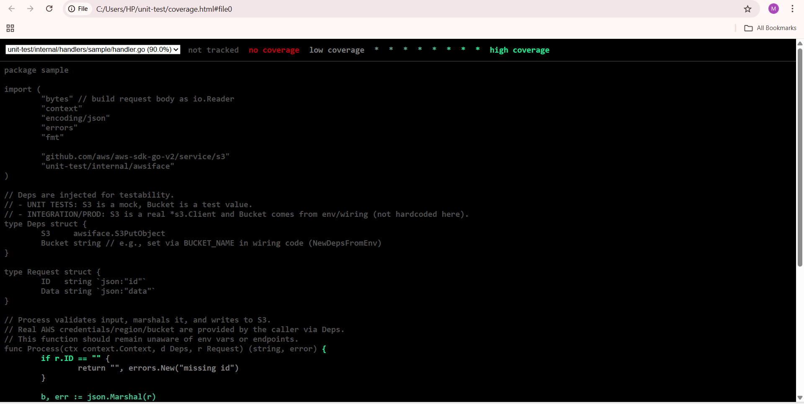
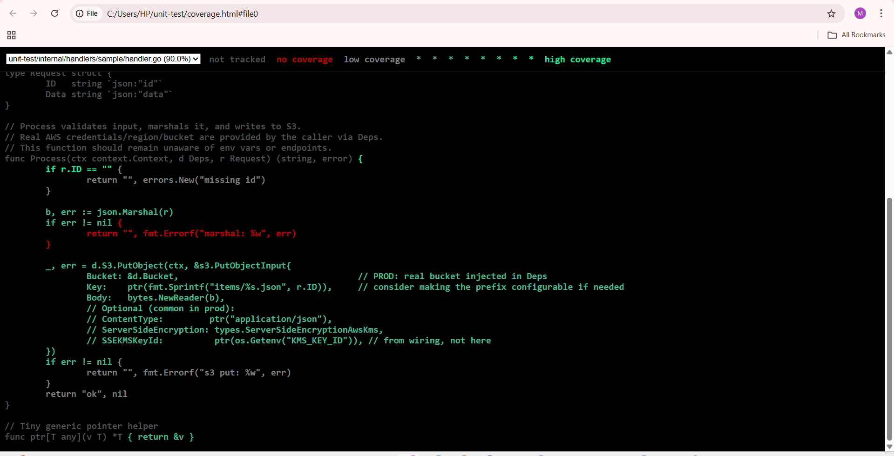

# Go Lambda Testing Framework

A standardized, reusable framework for writing **unit tests, benchmarks, and integration tests** for all AWS Lambda functions written in Go.

It ensures **code quality**, **reliability**, and **automation** across all Lambda projects.

---

## Repository Structure

```
unit-test/
├── Makefile                         # Test, coverage, mock, and benchmark commands
├── go.mod
├── go.sum                           # Go module + dependency management
├── .env
├── assets/
│ ├── coverage_1_overview.png
│ └── coverage_2_uncovered_lines.png
├── coverage.html
├── coverage.out
├── internal/
│   ├── awsiface/                    # AWS SDK interfaces for mocking
│   │   └── s3.go
│   ├── handlers/                    # Lambda function logic (with tests)
│   │   └── sample/
│   │       ├── handler.go
│   │       ├── handler_test.go
│   │       ├── handler_bench_test.go
│   │       └── handler_integration_test.go
│   └── testkit/                     # Shared test helpers/utilities
│       ├── assert.go
│       └── localstack.go
├── mocks/                           # Auto-generated mock files
│   └── mock_s3.go
├── scripts/                         # Automation scripts
│   └── coverage_check.sh
├── testdata/                         # Placeholder for JSON fixtures used in integration tests (kept empty by default for future data-driven tests)
└── .github/workflows/ci.yml         # CI pipeline (optional)


```

---

## Prerequisites

- **Go** 1.21+ (tested with 1.22)
- **Git** + a shell (Git Bash on Windows)
- **Mockgen** (for generating mocks)

  ```bash
  go install github.com/golang/mock/mockgen@v1.6.0
  echo 'export PATH="$PATH:$(go env GOPATH)/bin"' >> ~/.bashrc && source ~/.bashrc

  ```

- **Optional**: Docker Desktop + LocalStack for integration tests

## Environment Configuration

The framework uses a `.env` file to manage environment variables for both **LocalStack** and **real AWS testing**.

- The default `.env` (included in this repo) contains **safe, mock values** for LocalStack.
- For real AWS tests, uncomment the “Real AWS Configuration” section and replace with your actual values.
- ⚠️ Never commit `.env` files containing real AWS credentials or sensitive data.

## Getting Started

## 1️. Install dependencies

```bash
# Ensure all required modules (including godotenv) are installed
go get github.com/joho/godotenv@v1.5.1
go mod tidy

```

## 2. Generate AWS mocks

```bash
mingw32-make mocks    # Windows
make mocks            # macOS/Linux


```

## 3. Run all unit tests

```bash
mingw32-make unit

```

Runs all tests
Generates a coverage report (coverage.out)
Enforces ≥90% coverage via coverage_check.sh

## 4. Run performance benchmarks (optional)

```bash

mingw32-make bench

```

## 5. View coverage report

```bash
mingw32-make cover
```

This command:

- Runs coverage analysis on all test files
- Generates two reports:
  - coverage.out → machine-readable coverage data
  - coverage.html → a visual, browser-friendly report

The coverage.html file is automatically generated in your project root.
You can open it manually by double-clicking the file or running:

```bash
go tool cover -html=coverage.out

```

Then view it in your default browser.

### Code Coverage Visualization



> Coverage report generated after running `mingw32-make cover`.

The report (`coverage.html`) highlights tested and untested lines:

- 🟩 **Green** — code paths covered by tests
- 🟥 **Red** — untested branches (e.g., error paths or rare failure cases)



> The untested lines represent **error-handling logic** that only occurs in real AWS environments.  
> Since these tests run locally with **mocked S3 clients**, those failure scenarios are not expected to trigger.  
> In integration or production environments, real AWS responses would naturally cover these cases.

---

**Tip:**  
Open the file manually after running coverage:

```bash
start coverage.html     # Windows
open coverage.html      # macOS
xdg-open coverage.html  # Linux

```

## Running Integration Tests (LocalStack)

### 1. Start LocalStack

    ```bash
    docker run --rm -it -p 4566:4566 localstack/localstack

    ```

### 2. Run integration tests

Windows (PowerShell):

```powershell
$env:LOCALSTACK_ENDPOINT="http://localhost:4566"; go test -tags=integration ./...

```

Git Bash/macOS/Linux:

```bash
LOCALSTACK_ENDPOINT=http://localhost:4566 go test -tags=integration ./...

```

## Acceptance Criteria Mapping

| Requirement                    | How It’s Achieved                               |
| ------------------------------ | ----------------------------------------------- |
| **>90% coverage**              | Enforced automatically in `make unit` & CI      |
| **Mock AWS services**          | Implemented via `internal/awsiface/` + `mocks/` |
| **Success/failure test cases** | See `handler_test.go`                           |
| **Performance benchmarks**     | See `handler_bench_test.go`                     |
| **Integration test helpers**   | See `internal/testkit/localstack.go`            |
| **Automated testing in CI**    | `.github/workflows/ci.yml`                      |

## Adding a New Lambda

Create a new directory:

```bash
mkdir -p internal/handlers/<lambda-name>

```

Add:
handler.go – Lambda logic
handler_test.go – Unit tests
handler_bench_test.go – Benchmarks

Then run:

```bash
mingw32-make mocks
mingw32-make unit

```

## Adding New AWS Service Interfaces

Example (internal/awsiface/dynamodb.go):

```bash

package awsiface

import (
  "context"
  "github.com/aws/aws-sdk-go-v2/service/dynamodb"
)

type DynamoPutItem interface {
  PutItem(ctx context.Context, in *dynamodb.PutItemInput, optFns ...func(*dynamodb.Options)) (*dynamodb.PutItemOutput, error)
}

var _ DynamoPutItem = (*dynamodb.Client)(nil)

```

Generate the mock:

```bash
mingw32-make mocks

```

## Optional Integration Tests (LocalStack)

To test AWS calls locally:

Add internal/testkit/localstack.go:

```bash
//go:build integration
package testkit
// Add constructors for S3, DynamoDB, etc., using LOCALSTACK_ENDPOINT.

```

Run integration tests:

```bash

LOCALSTACK_ENDPOINT=http://localhost:4566 go test -tags=integration ./...

```

## Guardrails (Future Enhancements)

| Guardrail                  | Purpose                                                                             |
| -------------------------- | ----------------------------------------------------------------------------------- |
| **Branch protection rule** | Require CI to pass and ≥90% coverage before merge                                   |
| **Lint rule**              | Fail build if a new `internal/handlers/<lambda>` has `.go` files but no `*_test.go` |
| **Pre-commit hook**        | Auto-run `make mocks` and `make unit` before commits                                |

## Handy Commands (Windows Git Bash)

If make isn’t recognized:

```bash
echo 'alias make=mingw32-make' >> ~/.bashrc
source ~/.bashrc
```

Then you can just use:

```bash
make mocks
make unit
```

## Example Reference

| Component              | File                                             | Purpose                            |
| ---------------------- | ------------------------------------------------ | ---------------------------------- |
| **Sample Lambda**      | `internal/handlers/sample/handler.go`            | Core Lambda logic                  |
| **Unit tests**         | `internal/handlers/sample/handler_test.go`       | Success + failure + mock scenarios |
| **Benchmark**          | `internal/handlers/sample/handler_bench_test.go` | Performance testing example        |
| **Mock AWS interface** | `internal/awsiface/s3.go`                        | Mockable S3 client definition      |
| **Generated mock**     | `mocks/mock_s3.go`                               | Auto-generated via `mockgen`       |
| **Coverage script**    | `scripts/coverage_check.sh`                      | Enforces ≥90% coverage             |
| **Test utilities**     | `internal/testkit/assert.go`                     | Reusable assertions                |

## Outcome

This framework ensures:

Consistent Lambda testing patterns across the team

Isolated, reproducible unit tests (no real AWS calls)

Benchmarks for performance awareness

CI/CD enforcement of coverage and quality gates

## Quickstart

## 1. Clone the repo

```bash
git clone https://github.com/your-org/unit-test.git
cd unit-test

```

## 2. Generate mocks

```bash
mingw32-make mocks

```

## 3. Run tests with coverage gate

```bash
mingw32-make unit

```
