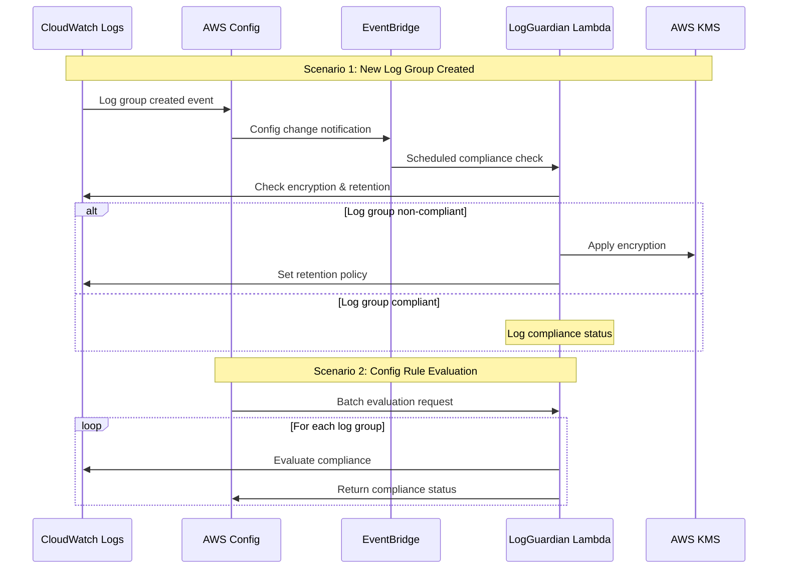
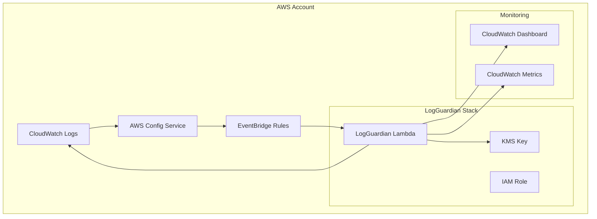
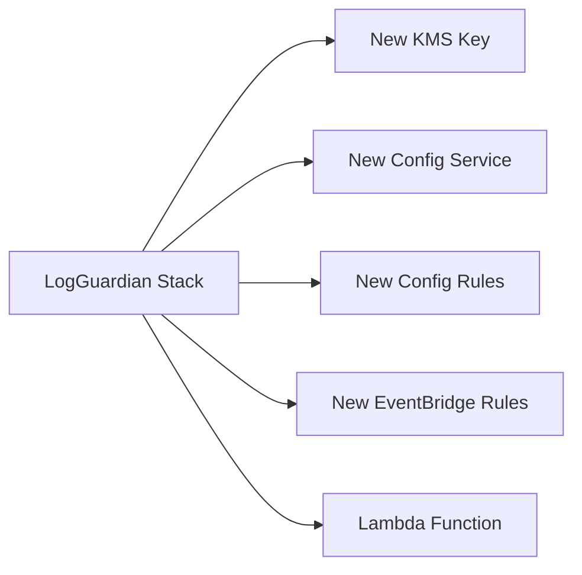
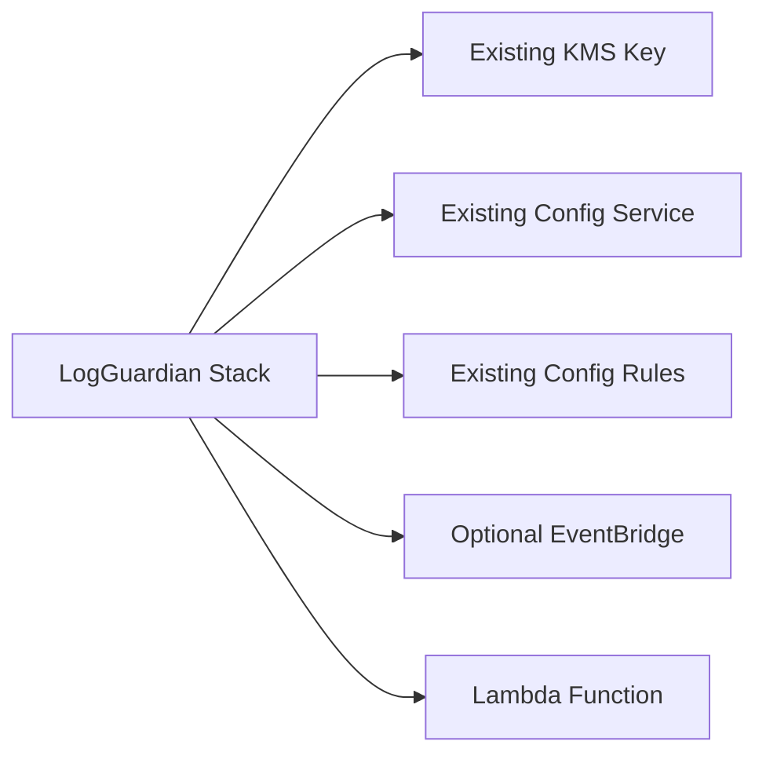
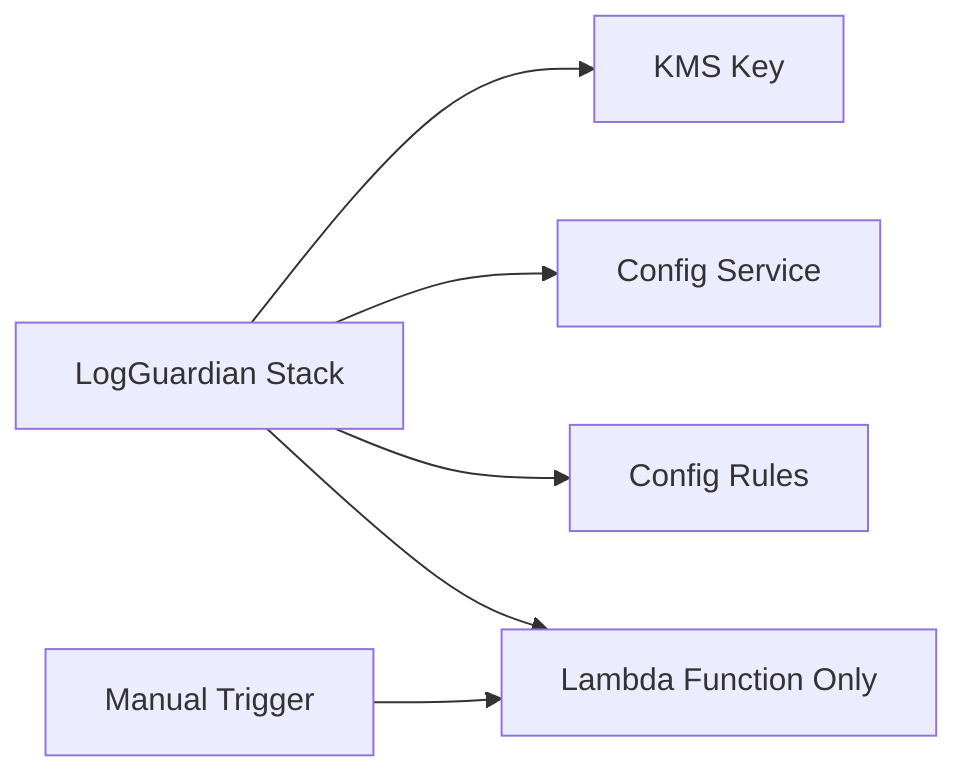

# LogGuardian Architecture Diagrams

## How LogGuardian Works - Sequence Diagram

## Architecture Overview

## Deployment Architecture Options

### Option 1: New Infrastructure (Default)

### Option 2: Existing Infrastructure (Enterprise)

### Option 3: Manual Invocation Only

