# LogGuardian Architecture Overview

## System Architecture

```mermaid
graph TB
    subgraph "AWS Account"
        subgraph "Triggers"
            EB1[EventBridge Rule<br/>Encryption Schedule<br/>🕐 Weekly]
            EB2[EventBridge Rule<br/>Retention Schedule<br/>🕐 Weekly]
            CFG1[Config Rule<br/>Encryption Compliance<br/>📋]
            CFG2[Config Rule<br/>Retention Compliance<br/>📋]
        end
        
        subgraph "LogGuardian Lambda"
            L[Lambda Function<br/>🚀 Go Runtime<br/>128MB Memory]
            LC[Rule Classifier<br/>🔍]
            KV[KMS Validator<br/>🔐]
            RM[Remediation Engine<br/>⚙️]
        end
        
        subgraph "AWS Services"
            CW[CloudWatch Logs<br/>📝]
            KMS[KMS Service<br/>🔑]
            CFG[Config Service<br/>⚙️]
            S3[S3 Bucket<br/>Config History<br/>📦]
            IAM[IAM Roles<br/>🛡️]
        end
        
        subgraph "Monitoring"
            DASH[CloudWatch Dashboard<br/>📊]
            LOGS[Lambda Logs<br/>📋]
            METRICS[CloudWatch Metrics<br/>📈]
        end
    end
    
    %% Trigger flows
    EB1 -->|Scheduled Trigger| L
    EB2 -->|Scheduled Trigger| L
    CFG1 -->|Compliance Event| L
    CFG2 -->|Compliance Event| L
    
    %% Lambda internal flow
    L --> LC
    LC -->|Encryption Rule| KV
    LC -->|Retention Rule| RM
    KV --> RM
    
    %% Service interactions
    RM -->|Apply Encryption| KMS
    RM -->|Set Retention| CW
    KMS -->|Encrypt| CW
    L -->|Check Compliance| CFG
    CFG -->|Store History| S3
    L -->|Assume Role| IAM
    
    %% Monitoring
    L -->|Write Logs| LOGS
    L -->|Publish Metrics| METRICS
    METRICS --> DASH
    LOGS --> DASH
    
    classDef trigger fill:#FFE5B4,stroke:#FF8C00,stroke-width:2px
    classDef lambda fill:#E6F3FF,stroke:#4169E1,stroke-width:2px
    classDef aws fill:#FFF0F5,stroke:#DB7093,stroke-width:2px
    classDef monitor fill:#F0FFF0,stroke:#228B22,stroke-width:2px
    
    class EB1,EB2,CFG1,CFG2 trigger
    class L,LC,KV,RM lambda
    class CW,KMS,CFG,S3,IAM aws
    class DASH,LOGS,METRICS monitor
```

## Component Description

### 1. **Triggers** 🎯
- **EventBridge Rules**: Schedule automated compliance checks
  - Encryption checks (default: Sunday 3 AM UTC)
  - Retention checks (default: Sunday 4 AM UTC)
- **Config Rules**: Real-time compliance monitoring
  - React to non-compliant resources immediately
  - Support both AWS managed and custom rules

### 2. **Lambda Function** 🚀
- **Runtime**: Go on `provided.al2023` (AWS Lambda custom runtime)
- **Memory**: 128MB (configurable, Go is memory-efficient)
- **Timeout**: 60 seconds (configurable up to 900s)
- **Features**:
  - Dual-mode operation (scheduled batch & event-driven)
  - Rule classification (encryption vs retention)
  - Batch processing with optimizations
  - KMS validation caching (only for encryption rules)

### 3. **Core Components** 🔧

#### Rule Classifier
- Identifies rule type from Config rule name
- Routes to appropriate remediation logic
- Patterns: `*encryption*`, `*retention*`

#### KMS Validator (Encryption Only)
- Validates KMS key accessibility
- Checks CloudWatch Logs permissions
- Caches validation for batch operations
- Skipped entirely for retention rules

#### Remediation Engine
- Applies encryption using KMS
- Sets retention policies
- Handles rate limiting with exponential backoff
- Supports dry-run mode

### 4. **AWS Service Integration** 🔗

| Service | Purpose | Operations |
|---------|---------|------------|
| **CloudWatch Logs** | Target for remediation | `PutRetentionPolicy`, `AssociateKmsKey` |
| **KMS** | Encryption keys | `DescribeKey`, `GetKeyPolicy` |
| **Config** | Compliance tracking | `GetComplianceDetailsByConfigRule` |
| **S3** | Config history storage | Read/Write config snapshots |
| **IAM** | Permissions | AssumeRole for cross-account |

### 5. **Monitoring & Observability** 📊

- **CloudWatch Dashboard**: Real-time metrics visualization
- **Lambda Logs**: Structured JSON logging with levels (ERROR, WARN, INFO, DEBUG)
- **Metrics Published**:
  - Log groups processed
  - Remediation success/failure
  - Processing duration
  - Rate limit hits

## Data Flow

### Scheduled Batch Processing
1. EventBridge triggers Lambda on schedule
2. Lambda queries Config for non-compliant resources
3. Rule classifier determines remediation type
4. For encryption: Validate KMS key once for batch
5. Apply remediation to all resources in parallel batches
6. Publish metrics to CloudWatch

### Event-Driven Processing
1. Config detects non-compliant resource
2. Sends compliance event to Lambda
3. Lambda analyzes specific resource
4. Apply targeted remediation
5. Update compliance status

## Deployment Options

### Parameters
- **Environment**: prod, staging, dev
- **CreateConfigService**: Use existing Config (default: false)
- **CreateKMSKey**: Create new or use existing
- **LogLevel**: ERROR, WARN, INFO, DEBUG
- **DefaultRetentionDays**: 1-3653 days

### Deployment Methods
1. **AWS SAR**: One-click deployment from Serverless Application Repository
2. **SAM CLI**: `sam deploy` with customization
3. **CloudFormation**: Direct stack creation
4. **Terraform**: Using CloudFormation resource

## Security Features 🔒

- **Encryption at Rest**: All log groups encrypted with KMS
- **Least Privilege**: Minimal IAM permissions
- **Resource Tagging**: Comprehensive tagging strategy
- **Audit Trail**: All actions logged with context
- **Compliance Tracking**: Config integration for audit

## Performance Optimizations ⚡

- **Batch Processing**: Process multiple resources in parallel
- **KMS Caching**: Validate once per batch (encryption only)
- **Rate Limit Handling**: Exponential backoff with jitter
- **Go Runtime**: Fast cold starts, low memory usage
- **Conditional Logic**: Skip unnecessary operations (e.g., KMS for retention)

## Cost Optimization 💰

- **Lambda**: Pay-per-invocation, 128MB memory
- **S3 Lifecycle**: Auto-expire old Config data
- **Log Retention**: Separate retention for Lambda logs
- **Conditional Resources**: Only create what's needed

## Version History

- **v1.2.6**: Performance fix - Skip KMS validation for retention rules
- **v1.2.5**: Improved parameter descriptions for SAR
- **v1.2.4**: Removed CustomerTagPrefix, fixed Config dependencies
- **v1.2.0**: Added LogLevel configuration
- **v1.0.0**: Initial release